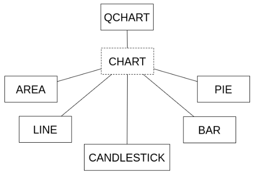
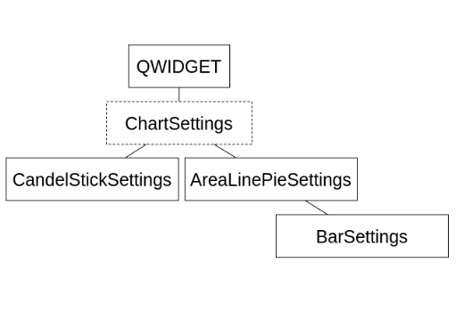

# ChartCreator

[English version below](#english-version)

1. [Introduzione](#introduzione)
2. [Gerarchie utilizzate](#gerarchie-utilizzate)
3. [Istruzioni sulla compilazione ed esecuzione](#istruzioni-su-compilazione-ed-esecuzione)

## 1. Introduzione

Un programma che riceve in input una serie di dati in forma tabellare, e genera un diagramma rappresentativo.

Sviluppato come progetto accademico per il corso di Programmazione ad oggetti, il cui scopo era quello di applicare le conoscenze acquisite. Nello specifico sono stati sfruttati al meglio l'utilizzo del polimorfismo e il concetto di ereditarietà.

L'applicazio scrive e legge da file dei dati che rappresentano una sessione.

## 2. Gerarchie utilizzate e UML

### UML

### Chart

### ChartSettings

## 3. Istruzioni su compilazione ed esecuzione

Eseguire il comando `qmake && make` sulla cartella clonata.

Viene generato da qt una cartella con la seguente struttura:

- ChartCreator (eseguibile)
- build
  - moc (files .moc)
  - obj (files .obj)
  - rcc (files .rcc)

# English version

1. [Introduction] (#introduction)
2. [Hierarchies] (#hierarchies)
3. [Build] (#build)

## 1. Introduction

A program that receives input a series of data in tabular form, and generates a representative diagram.

Developed as an academic project for the course of Object-oriented Programming, whose purpose was to apply the acquired knowledge. Specifically, the use of polymorphism and the concept of inheritance were considered central during the development .

The application also writes to and reads from files that represent a working session.

## 2. Hierarchies and UML

### UML

### Chart

### ChartSettings

## 3. Build

Execute `qmake && make` on the root folder.

Qt generates a folder named ChartCreator structured as follows:

- ChartCreator (executable)
- build
  - moc (.moc files)
  - obj (.obj files)
  - rcc (.rcc files)
